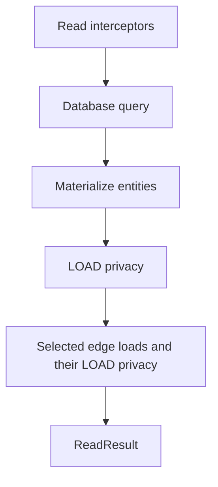
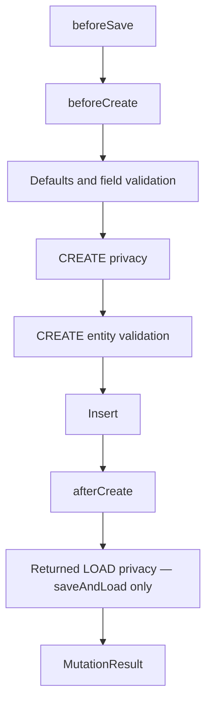
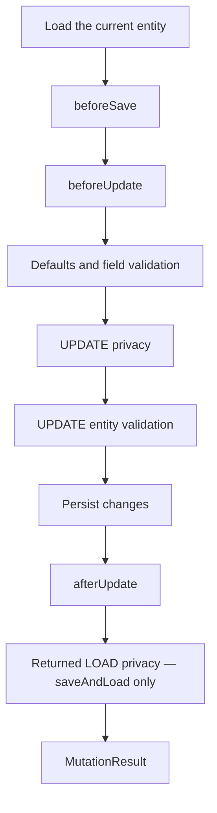
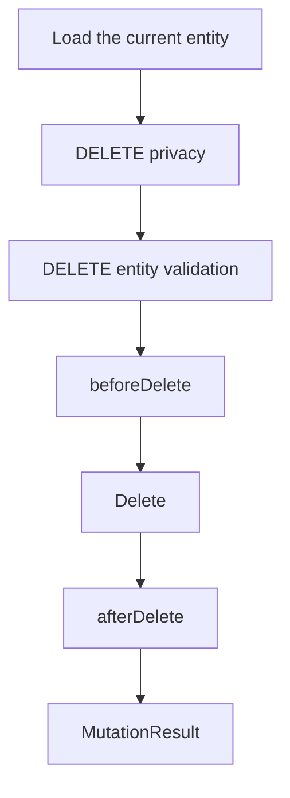
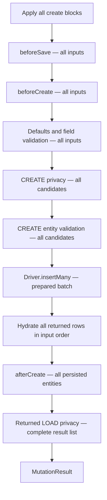
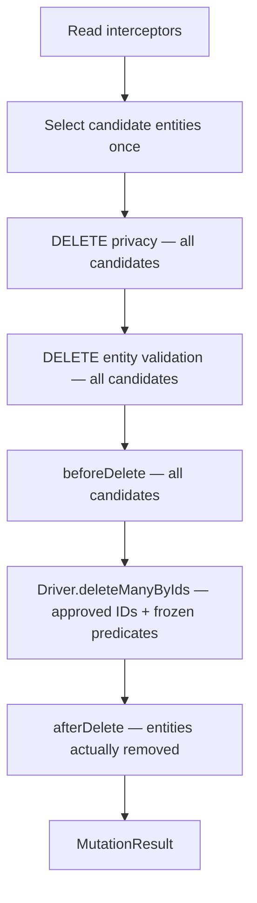

# Operation Lifecycle

EntKt has several ways to participate in an operation: read interceptors,
hooks, field validation, entity validation, write privacy, and LOAD privacy.
They solve different problems and run at different points.

This guide explains which mechanism to use and the order in which each CRUD
operation applies them.

## Choosing a Mechanism

| Mechanism | Use it for | Example |
|---|---|---|
| Read interceptor | Automatically constrain or reject queries before they reach storage | Apply tenant scope to every query |
| `beforeSave` | Apply the same assignment to both creates and updates | Set `updatedAt` |
| `beforeCreate` | Create-only normalization or enrichment | Set `createdAt` or derive an initial value |
| `beforeUpdate` | Update-only behavior that needs the stored row or requested patch | Record an audit entry when a value changes |
| `beforeDelete` | Trusted work immediately before an authorized delete | Prepare delete-side cleanup |
| Field validator | Validate one field independently | Enforce length or numeric range |
| Entity validator | Enforce an invariant involving multiple fields or a database lookup | Ensure a date range is valid |
| Write privacy | Decide whether the viewer may create, update, or delete | Require ownership or an administrator role |
| LOAD privacy | Decide whether a materialized entity may be returned | Hide private notes from other users |
| After hook | Observe the persisted entity after a database statement succeeds | Inspect driver-generated values |
| Database constraint | Enforce an invariant safely under concurrency | Guarantee uniqueness or referential integrity |

Use privacy for authorization, validators for data invariants, and hooks for
trusted lifecycle behavior. Database constraints remain necessary for
invariants that must hold under concurrency; a validator that queries first can
race another transaction.

### Why Both `beforeSave` and Operation-Specific Hooks?

`beforeSave` is a narrow convenience for assignments that must happen on both
create and update. It receives the shared mutation interface and should normally
be used for set-and-forget behavior:

```kotlin
beforeSave { mutation ->
    mutation.updatedAt = clock.now()
}
```

Use `beforeCreate` or `beforeUpdate` when the behavior differs by operation or
needs operation-specific context:

```kotlin
import entkt.runtime.mutation.FieldPatch

beforeCreate { ctx ->
    ctx.mutation.createdAt = clock.now()
}

beforeUpdate { ctx ->
    if (ctx.patch.name is FieldPatch.Set) {
        auditNameChange(ctx.before.id)
    }
}
```

`beforeSave` runs first, so the operation-specific hook can refine or override
its assignments.

### Field Validation vs. Entity Validation

Use a field validator when a value can be judged on its own. Use an entity
validator when the rule depends on several fields, the stored entity, an edge,
or a database query.

Field validation runs before write privacy because it checks the shape of the
pending request. Entity validation runs after write privacy so an unauthorized
caller cannot use invariant failures to learn about protected data.

## General Guarantees

- A rejection or failure stops the operation; later stages do not run.
- Hooks of the same kind run in registration order.
- Privacy rules run in declaration order. `Allow` or `Deny` finalizes that item;
  in a batch, later rules receive only still-unresolved items. Reaching the end
  without either denies each remaining item.
- All reached entity validators run, and their violations are collected.
- `afterCreate`, `afterUpdate`, and `afterDelete` mean "after the database
  statement," not "after transaction commit." They still run inside an open
  transaction.
- A mutation can fail after its write executes, such as in an after hook or
  returned-entity LOAD check. Inspect the exception's `writeState` before
  deciding whether a retry is safe.
- Multi-item lifecycle phases are callback-major: one registered rule or hook
  handles every item that reaches it before the next registered callback runs.
  Ordinary scalar callbacks adapt automatically by visiting those items in
  encounter order; callbacks are never run concurrently.
- Privacy and validation pass phase-wide state separately from generated
  item values. Every rule in a phase sees the same shared rule context, while
  each reached rule receives fresh defensive item snapshots.

## Reads

Materializing terminals such as `findById()`, `firstOrNull()`, and `all()` use
this order:



Read interceptors shape what storage is asked to return. LOAD privacy decides
whether the materialized entities may be disclosed. They are separate because
a query may be valid while a selected entity is not visible to the viewer.

Important behavior:

- One terminal uses one viewer context across its interceptors, root LOAD
  privacy, traversal work, and selected edge loads.
- Root LOAD privacy evaluates the materialized result as one ordered batch.
  Each edge-load query likewise evaluates its ordered, deduplicated, in-window
  targets as one batch before strict or `filterVisible()` projection.
- LOAD denial is strict by default and returns a failed result.
- `visibleOrNull()` converts only a singular root LOAD denial to successful
  absence. It does not hide query, driver, or edge-load failures.
- A selected edge is strict unless its `EdgeLoad` handle opts into
  `filterVisible()`.
- Raw terminals such as `rawCount()` and `rawExists()` run read interceptors but
  do not materialize entities and therefore do not run LOAD privacy. A query
  with selected edge loads fails those terminals with
  `EntQueryConfigurationException` before interceptor or driver work — they
  cannot expose loaded edges, so the selection is rejected, never ignored.
- Reads do not run mutation hooks or validators.

See [Queries](04-queries.md) for query construction, traversal, edge loading,
and interceptors, and [Privacy](06-privacy.md) for LOAD-denial handling.

## Create

`create { ... }.save()` and `saveAndLoad()` use this order:



Important behavior:

- Before hooks run before defaults and field validation. A hook can populate or
  repair a value before it is checked.
- CREATE privacy sees the resolved candidate after hooks, defaults, and field
  checks.
- A privacy denial stops entity validation, insertion, and later hooks.
- `save()` runs the write lifecycle through `afterCreate` but does not disclose
  the entity, so it skips returned LOAD privacy.
- `saveAndLoad()` can fail LOAD privacy after insertion and `afterCreate`.
  Check `writeState` before retrying.

## Update

`update(id) { ... }.save()` and `saveAndLoad()` use this order:



The current entity is loaded first so `beforeUpdate`, privacy, and validation
can reason about the stored state and the requested change. This internal load
does not run LOAD privacy: UPDATE privacy is the authority for whether the
viewer may mutate the row.

Important behavior:

- An absent target fails before update hooks, UPDATE privacy, or validation.
- `beforeUpdate` receives the stored `before` entity and the requested patch.
- UPDATE privacy and entity validation see the candidate after hooks, defaults,
  and field checks.
- A no-op update still establishes that the target exists and runs hooks,
  UPDATE privacy, and entity validation. It skips the database write and
  `afterUpdate`.
- `saveAndLoad()` applies LOAD privacy to the returned entity after the update
  lifecycle. A failure at that stage does not mean the write was undone.

## Delete

`delete(entity)` and `deleteById(id)` use this order:



Important behavior:

- Delete is idempotent. If the row is already absent, the operation succeeds
  without running privacy, validation, or hooks.
- The internal current-row load does not run LOAD privacy. DELETE privacy is
  the authority for whether the viewer may remove the row.
- `beforeDelete` runs after privacy and entity validation. It can perform
  trusted preparatory work, but it cannot repair the candidate or authorize the
  delete.
- `afterDelete` runs only when this call actually removed the row.

## Bulk Operations

Generated bulk operations are phase-major. They retain input or candidate
encounter order while completing each lifecycle phase for the whole batch
before moving to the next phase.

On generated-ID repositories, `createMany()` uses this order. Explicit-ID
repositories currently expose only `create(id) { ... }`, not a bulk-create
signature:



Every before-hook, privacy rule, and validator finishes before persistence.
The complete insert and hydration finish before any `afterCreate` hook. The
terminal returns the complete entity list in input order or one failure, never
a partial list.

Because `createMany()` returns entities, returned LOAD privacy is part of the
terminal. In an EntKt-owned transaction, disclosure failure is carried while
commit is attempted: a confirmed commit yields `writeState = Committed`, a
confirmed rollback yields `NotPersisted`, and an uncertain transaction boundary
yields `PersistenceUnknown`. In a caller-owned transaction it is
`TransactionPending`, marks the transaction rollback-only, and the transaction
boundary can confirm rollback. Do not retry based only on the failed result;
inspect `writeState`.

`deleteMany()` uses this order:



The write reuses the exact effective caller and interceptor predicates from
candidate selection and combines them with the approved IDs. Interceptors are
not rerun. A row that disappears or stops matching before the write is not
counted and does not reach `afterDelete`; a row that starts matching after
selection is outside the approved ID set. A denied or invalid candidate fails
the entire call before deletion rather than being silently skipped.

Both methods use one transaction for their database work (the caller's, or an
EntKt-owned transaction). This does not make external effects performed by
hooks transactional. There is deliberately no generated lifecycle-aware
`updateMany()`; the low-level driver method of that name skips generated hooks,
privacy, and validation.

## Learn More

- [Hooks](05-hooks.md) documents each hook context and the state it exposes.
- [Privacy](06-privacy.md) documents read, write, and returned-entity privacy.
- [Validation](07-validation.md) covers field and entity validation APIs.
- [Queries](04-queries.md) covers read interceptors, traversal, and edge loads.
- [Drivers](10-drivers.md) covers transactions and write-outcome certainty.
