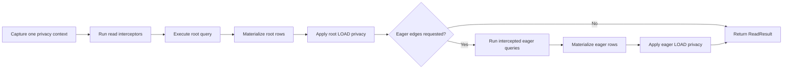
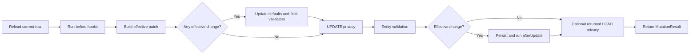

# CRUD Operation Lifecycle

This guide is the source of truth for the order in which generated repository
operations apply query interceptors, hooks, defaults, field checks, privacy,
entity validation, database work, and returned-entity privacy.

It describes generated repository APIs. Calling low-level `Driver` methods
directly does not run hooks, privacy, or entity validation.

## Lifecycle Guarantees

The stages below run in the documented order. If a stage rejects the operation
or fails, later stages do not run unless a section explicitly says otherwise.

- Query and mutation builder blocks run when the builder is configured, before
  a result-bearing terminal begins. An exception thrown directly by a block such
  as `query { ... }`, `create { ... }`, or `update(id) { ... }` therefore throws
  normally; it is not converted into `ReadResult.Failed` or
  `MutationResult.Failed` by a later terminal.
- Once a result-bearing terminal begins, ordinary `Exception`s are captured in
  its result. Cancellation and JVM `Error`s continue to propagate normally.
- `getOrThrow()`, `visibleOrNull()`, and `orRollback()` only project or transform
  an existing result. They do not repeat the operation or perform more I/O.
- Multiple hooks of the same kind run in registration order. `beforeSave` runs
  before the operation-specific `beforeCreate` or `beforeUpdate` hooks.
- Privacy rules run in declaration order. The first `Allow` or `Deny` ends that
  privacy phase; reaching the end with only `Continue` decisions denies the
  operation.
- Every entity-validation rule in a reached phase runs, and all returned
  violations are collected. Required-field and generated field checks happen
  earlier and may stop the operation with a field violation before entity
  validation is reached. Do not depend on the ordering or aggregation of those
  earlier field violations.
- Field checks validate local request shape before write privacy. Entity
  validation runs after write privacy, so a denied caller cannot observe
  database-backed invariant errors.
- `afterCreate`, `afterUpdate`, and `afterDelete` mean "after the database
  statement," not "after the surrounding transaction commits." Inside
  `withTransaction`, they still run inside the open transaction.
- A failed mutation result does not by itself mean that no write occurred.
  Always interpret the exception's `writeState`, especially for failures from
  an after hook, returned LOAD privacy, or a driver whose write outcome is
  uncertain.
- A single create or update captures its operation privacy context after the
  before-hook and field-check stages and reuses it for write privacy and
  `saveAndLoad()` disclosure. An explicit `currentPrivacyContext()` call made
  by application code inside a hook is a separate provider invocation.

## Read

Materializing terminals include `findById()`, `firstOrNull()`, and `all()`.
Their lifecycle is:

1. Capture one `PrivacyContext` for the terminal.
2. Run read-path interceptors, including any traversal-source and edge-predicate
   interceptor steps needed by the query.
3. Execute the root database query.
4. Materialize the selected root rows.
5. Run root LOAD privacy on the materialized rows.
6. If eager edges were requested, execute their intercepted queries,
   materialize their rows, and apply eager LOAD privacy.
7. Return `ReadResult.Success`, or `ReadResult.Failed` if any reached stage
   rejected or failed.

The captured context is shared by the root interceptors, root LOAD privacy, and
every traversal or eager-load step belonging to that terminal. A changing
context provider cannot cause one terminal to authorize different parts of the
same read as different viewers.

Any rejection or failure stops the flow at that stage and produces the
corresponding failed result. The diagram shows the successful path.

### Read guarantees and pitfalls

- Authoritative absence is successful: `findById()` and `firstOrNull()` return
  `Success(null)` when no row is selected.
- LOAD privacy is strict by default. A denied selected root produces
  `Failed(EntPrivacyDeniedException)`; it is not silently omitted.
- `firstOrNull()` does not scan for a later visible row when the selected first
  row is denied.
- `visibleOrNull()` maps only a singular root LOAD denial to `Success(null)`.
  It does not hide query rejection, driver failure, privacy-rule exceptions, or
  eager-edge denial.
- Root LOAD privacy completes before eager loading begins. A visible root whose
  eager target is denied fails with an eager-edge denial rather than becoming
  absent.
- Eager loading is strict unless that specific eager handle opts into
  `filterVisible()`. Nested eager edges make that choice independently.
- Traversal source rows shape the target query but are not materialized, so
  source LOAD privacy does not run. LOAD privacy applies to the returned target
  rows. Materialize the source separately when its visibility must also be
  established.
- `rawCount()`, `rawExists()`, and raw aggregates run read interceptors but do
  not materialize entities or apply LOAD privacy. Their `raw` prefix is a
  deliberate storage-level contract, not a visibility guarantee.
- Reads do not run mutation hooks, field validators, or entity validators.

See [Queries](04-queries.md) for query construction, traversal, eager loading,
and interceptor configuration, and [Privacy](06-privacy.md) for LOAD-denial
handling.

## Create

`create { ... }.save()` and `create { ... }.saveAndLoad()` share one write
pipeline:

The three mutation pipelines differ most visibly in where hooks and privacy
run. These lanes show the successful, write-performing paths; the detailed
sections below cover absence, no-op updates, and failures.

```mermaid
flowchart TB
    subgraph create[Create]
        direction LR
        cHooks["Before hooks"] --> cFields["Defaults and field checks"]
        cFields --> cPrivacy["CREATE privacy"]
        cPrivacy --> cValidation["Entity validation"]
        cValidation --> cWrite["Insert"]
        cWrite --> cAfter["afterCreate"]
        cAfter -. "saveAndLoad" .-> cLoad["Returned LOAD privacy"]
    end

    subgraph update[Update]
        direction LR
        uReload["Reload current row"] --> uHooks["Before hooks"]
        uHooks --> uFields["Patch and field checks"]
        uFields --> uPrivacy["UPDATE privacy"]
        uPrivacy --> uValidation["Entity validation"]
        uValidation --> uWrite["Persist changes"]
        uWrite --> uAfter["afterUpdate"]
        uAfter -. "saveAndLoad" .-> uLoad["Returned LOAD privacy"]
    end

    subgraph delete[Delete]
        direction LR
        dReload["Reload current row"] --> dPrivacy["DELETE privacy"]
        dPrivacy --> dValidation["Entity validation"]
        dValidation --> dBefore["beforeDelete"]
        dBefore --> dWrite["Delete"]
        dWrite --> dAfter["afterDelete"]
    end
```

1. Enforce the configured transaction requirement.
2. Run every `beforeSave` hook, then every `beforeCreate` hook.
3. Resolve required values and defaults, then run generated field validators.
4. Capture the operation's `PrivacyContext` and build the create candidate.
5. Run CREATE privacy.
6. Run all CREATE entity-validation rules and collect their violations.
7. Insert the row and materialize the persisted entity, including database or
   driver-generated values.
8. Run every `afterCreate` hook with the persisted entity.
9. For `saveAndLoad()` only, run LOAD privacy on the returned entity.
10. Return success or the captured failure.

### Create guarantees and pitfalls

- Before hooks run before defaults. A hook assignment therefore wins over a
  default, and hooks can repair or populate values before field checks run.
- CREATE privacy sees the resolved candidate after hooks, defaults, required
  checks, and field validation.
- A CREATE privacy denial prevents entity validation, insertion, after hooks,
  and returned LOAD privacy.
- `save()` still materializes the persisted row when needed by the write
  pipeline and still runs `afterCreate`; it only skips returned-entity LOAD
  privacy and returns `Unit` instead of disclosing the entity.
- `saveAndLoad()` can fail LOAD privacy after a successful insert and after
  `afterCreate`. That failure does not retroactively undo an autocommit write;
  inspect `writeState` before deciding whether retry is safe.
- An `afterCreate` exception is also post-write. Inside a caller-owned
  transaction the write is pending and the transaction becomes rollback-only;
  outside one, the write may already be committed.

## Update

`update(id) { ... }.save()` and `saveAndLoad()` use this lifecycle for a real
scalar, foreign-key, or link-table edge update:

1. Enforce transaction, consistency, driver-capability, and relationship-lock
   requirements that apply to the requested update.
2. Reload the current entity, using the configured consistency mode. This
   internal read does not apply LOAD privacy.
3. If the target is absent, return
   `Failed(EntTargetAbsentException)` before hooks, UPDATE privacy, or
   validation.
4. Capture pending edge intent.
5. Run every `beforeSave` hook, then every `beforeUpdate` hook. Each
   `beforeUpdate` hook receives a patch snapshot taken at that hook's entry.
6. Check required fields, build the final requested patch, and calculate link
   table edge changes when needed.
7. If the update is assignment-free, follow the no-op path described below.
8. Apply update defaults and run generated field validators on values present
   in the effective patch.
9. Capture the operation's `PrivacyContext` and construct the full candidate
   after-state.
10. Run UPDATE privacy.
11. Run all UPDATE entity-validation rules. When
    `updateDerivesFromCreate()` is configured, run the update rules first and
    then the derived create rules; collect all returned violations.
12. Persist the owner-row changes and then any link-table edge changes.
13. Run every `afterUpdate` hook with the resulting entity.
14. For `saveAndLoad()` only, run LOAD privacy on the returned entity.
15. Return success or the captured failure.

### No-op updates

An empty request, or one whose before hooks remove every scalar, foreign-key,
and link-table edge change, still establishes the target's existence and runs:

1. update preflight and current-row reload,
2. before hooks and required-field checks,
3. UPDATE privacy,
4. UPDATE entity validation, and
5. returned LOAD privacy for `saveAndLoad()`.

It skips update defaults, effective-patch field validators, database writes,
and `afterUpdate`, then succeeds. A link-table edge request is not a no-op merely
because it contains no scalar assignment; EntKt computes and applies its actual
edge delta.

### Update guarantees and pitfalls

- The current-row reload intentionally bypasses LOAD privacy. UPDATE privacy is
  the authoritative permission to mutate; a viewer may be allowed to update a
  row they cannot load.
- Target absence is determined before UPDATE privacy. Do not expose
  `EntTargetAbsentException` directly when an application boundary must cloak
  existence.
- `beforeUpdate.before`, UPDATE privacy, and update validation see the reloaded
  stored row rather than an entity supplied by the caller.
- `UpdateConsistency.ReadCurrent` does not promise that another transaction
  cannot change the row after it is read. Use `Pessimistic` inside a transaction
  when the decision must be protected by a row lock.
- Required-field checks run after before hooks, so a hook may repair or remove
  an invalid assignment before it fails.
- UPDATE privacy and entity validation see both caller/hook intent and the
  effective patch after framework defaults, plus computed edge changes.
- A row that disappears between reload and the owner update returns
  `EntTargetAbsentException`; `afterUpdate` and returned LOAD privacy do not run.
- As with create, an after-hook or returned LOAD failure may occur after the
  write. Inspect `writeState` rather than assuming the operation is safe to
  retry.

See [Edges](03-edges.md#link-table-m2m-mutators) for transaction requirements
and locking behavior of link-table many-to-many updates.

## Delete

`delete(entity)` and `deleteById(id)` share the same reload-then-delete
pipeline. The entity passed to `delete(entity)` is an ID handle; its other field
values are not trusted as current state.

1. Enforce the configured transaction requirement.
2. Reload the current row by ID without applying LOAD privacy.
3. If no row exists, return success immediately. `delete(entity)` returns
   `Success(Unit)` and `deleteById(id)` returns `Success(false)`.
4. Capture the operation's `PrivacyContext` and build the delete candidate from
   the reloaded row.
5. Run DELETE privacy.
6. Run all DELETE entity-validation rules and collect their violations.
7. Run every `beforeDelete` hook.
8. Issue the delete.
9. If this call removed the row, run every `afterDelete` hook.
10. Return success or the captured failure.

### Delete guarantees and pitfalls

- DELETE privacy is independent of LOAD privacy. A viewer may be allowed to
  delete a row they cannot load.
- An already-absent row runs no DELETE privacy, validation, or hooks.
- Unlike create and update, `beforeDelete` runs after DELETE privacy and entity
  validation. Delete hooks cannot authorize an operation or repair its
  candidate.
- A row may disappear after reload and after `beforeDelete` but before the
  delete statement. In that case `deleteById()` returns `Success(false)` and
  `afterDelete` does not run.
- `afterDelete` runs after the delete statement, but may still be inside an open
  caller-owned transaction. It is not an after-commit callback.

## Bulk Operations

Generated bulk operations preserve the per-row lifecycles above but add an
atomic transaction boundary.

Bulk methods may invoke the privacy-context provider once per row because they
delegate to the corresponding per-entity pipeline, and may invoke it again for
return processing or candidate selection. Providers must remain stable for the
duration of the request or logical operation.

### `createMany()`

1. Enforce the transaction requirement for the batch shape.
2. Run each row's create pipeline through `afterCreate`, without returned LOAD
   privacy.
3. After every row's write-side work succeeds, run LOAD privacy for the returned
   entities in input order.
4. Return the complete list in input order or one failure; never return a
   partial list.

A write-side failure rolls back the EntKt-owned batch transaction, or marks a
caller-owned transaction rollback-only. Returned-entity disclosure is different:
when EntKt owns the transaction, all completed writes are committed even if the
later LOAD check cannot disclose the list, and the failure reports
`writeState = Committed`. Do not treat that failure as permission to retry the
batch blindly.

### `deleteMany()`

1. Enforce the transaction requirement.
2. Run read interceptors to select candidate rows. Candidate selection does not
   apply LOAD privacy.
3. Run the delete privacy, validation, and hook pipeline for each selected row.
4. Commit the complete batch, or roll it back on the first failure.

No denied or invalid candidate is silently skipped. An empty candidate set
returns `Success(0)` and runs no per-row privacy, validation, or hooks.

The low-level `Driver.insertMany()`, `updateMany()`, and `deleteMany()` methods
are storage primitives and do not provide these generated lifecycle guarantees.

## Choosing the Right Mechanism

| Mechanism | Purpose | Ordering contract |
|---|---|---|
| Read interceptor | Narrow or reject a query before storage access | Before the corresponding database read |
| Before hook | Normalize or enrich a pending create/update; react before delete | At the operation-specific hook stage above |
| Field validator | Enforce local field shape | After the create/update before hooks; before write privacy |
| Write privacy | Decide whether the viewer may perform the mutation | Before entity validation and persistence |
| Entity validator | Enforce cross-field or database-backed invariants | After write privacy and before persistence |
| After hook | React to a successful database statement | After the statement, not necessarily after commit |
| LOAD privacy | Decide whether a materialized entity may be disclosed | After materialization; after write-side hooks for `saveAndLoad()` |

Use privacy for authorization, validation for invariants, and hooks for trusted
lifecycle behavior. Database constraints remain necessary for invariants that
must hold under concurrency: validation queries run before the write and can
race another transaction.

The clients exposed to these mechanisms also have different visibility
postures. Privacy rules receive a caller-context read client, validators receive
a privacy-bypassing read client for invariant checks, and hook contexts receive
the same repository and transaction scope as the mutation. Choose the narrowest
client type that matches the helper's purpose; do not treat a raw terminal or a
validation read as proof that the current viewer could load the row.
